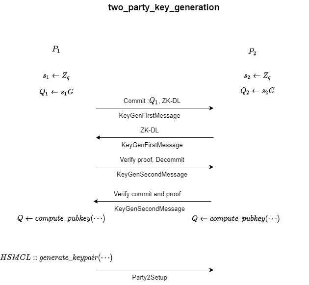
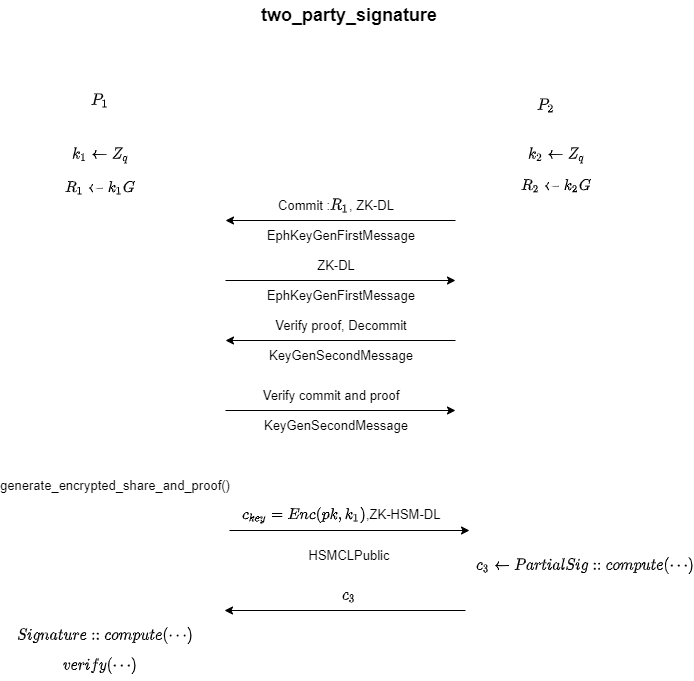

# Two-party-SM2
本项目是基于哈希证明系统的两方SM2签名的Rust实现。该方案设计主要参考了[1]，代码实现参考了[2]。

## 依赖库

Rust统一使用cargo从crate.io下载所需要的依赖库，该项目主要依赖库如下所示：
|  库                                               |    说明                                                            |
| -------------------------------------------- | -------------------------------------------- |
|[curv-kzen](https://github.com/ZenGo-X/curv) | 椭圆曲线相关函数实现，包括大整数、椭圆曲线群、承诺以及证明 |
|[class_group](https://github.com/ZenGo-X/class) | 类群相关函数实现，主要包括同态加密及其零知识证明 |

***
推荐使用MacOS或者Linux，因为在Windows下，编译`class_group`库的时候可能会报错：` Caused by:
      %1 不是有效的 Win32 应用程序。 (os error 193)`，疑似是32位与64位的兼容问题。
***
## 代码使用
1. 在电脑上安装[Rust](https://rustup.rs/)和[GMP](https://gmplib.org)
2. 运行 `cargo build --release`
3. 在 `target/release`文件夹下可以发现可执行文件`two-party-sm2`，直接运行

上述的第2步与第3步也可以直接运行`cargo run --release`代替。

## 说明
在下面两图中，结合整个两方SM2方案，我简要说明了各个函数起到的功能：

## 参考
[1]<https://eprint.iacr.org/2019/503.pdf>

[2]<https://github.com/ZenGo-X/multi-party-ecdsa>

